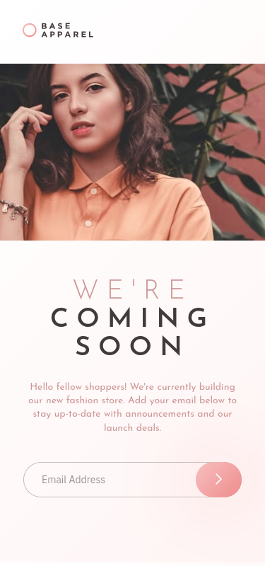
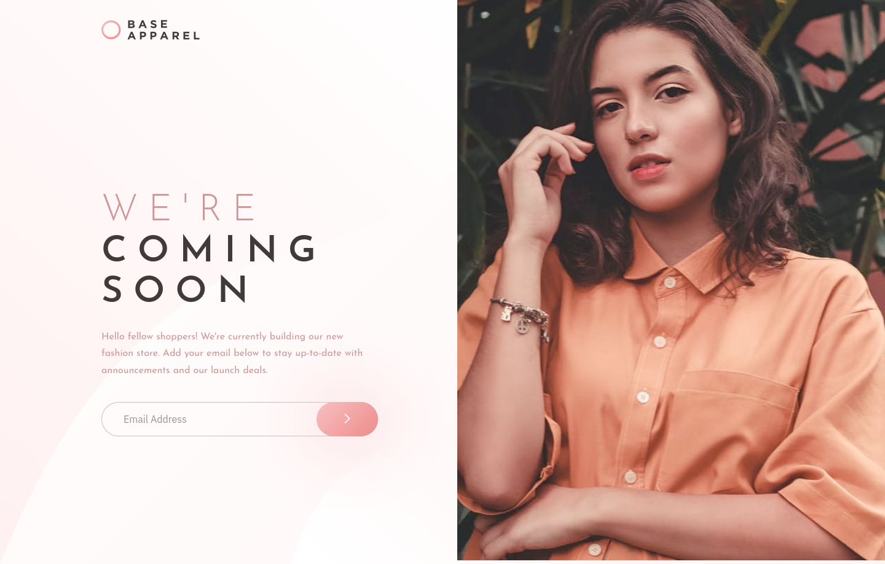

# Frontend Mentor - Base Apparel coming soon page solution

This is a solution to the [Base Apparel coming soon page challenge on Frontend Mentor](https://www.frontendmentor.io/challenges/base-apparel-coming-soon-page-5d46b47f8db8a7063f9331a0). Frontend Mentor challenges help you improve your coding skills by building realistic projects. 

## Table of contents

- [Overview](#overview)
  - [The challenge](#the-challenge)
  - [Screenshot](#screenshot)
  - [Links](#links)
- [My process](#my-process)
  - [Built with](#built-with)
  - [Continued development](#continued-development)
  - [Useful resources](#useful-resources)
- [Author](#author)

## Overview

### The challenge

Users should be able to:

- View the optimal layout for the site depending on their device's screen size
- See hover states for all interactive elements on the page
- Receive an error message when the `form` is submitted if:
  - The `input` field is empty
  - The email address is not formatted correctly

### Screenshot

### Links

- [Solution URL](https://github.com/edsonv/base-apparel-coming-soon)
- [Live Site URL](https://edsonv.github.io/base-apparel-coming-soon)

## My process

### Built with

- Semantic HTML5 markup
- SCSS
- RSCSS
- CSS Grids
- Flexbox
- Mobile-first workflow - Progressive enhancement
- [React](https://reactjs.org/) - JS library

### Continued development

Improve form validation using setCustomValidity API and the use of React Hooks.

### Useful resources

- [How to build responsive images with srcSet - SitePoint](https://www.sitepoint.com/how-to-build-responsive-images-with-srcset/) - This helped me set the images that were going to render depending on the viewport width.
- [ValidityState - Web APIs | MDN](https://developer.mozilla.org/en-US/docs/Web/API/ValidityState) - This is the documentation on the ValidityState API that helped me to write a custom validation message for the form.

## Author

- Github - [@edsonv](https://github.com/edsonv)
- Frontend Mentor - [@yourusername](https://www.frontendmentor.io/profile/yourusername)

